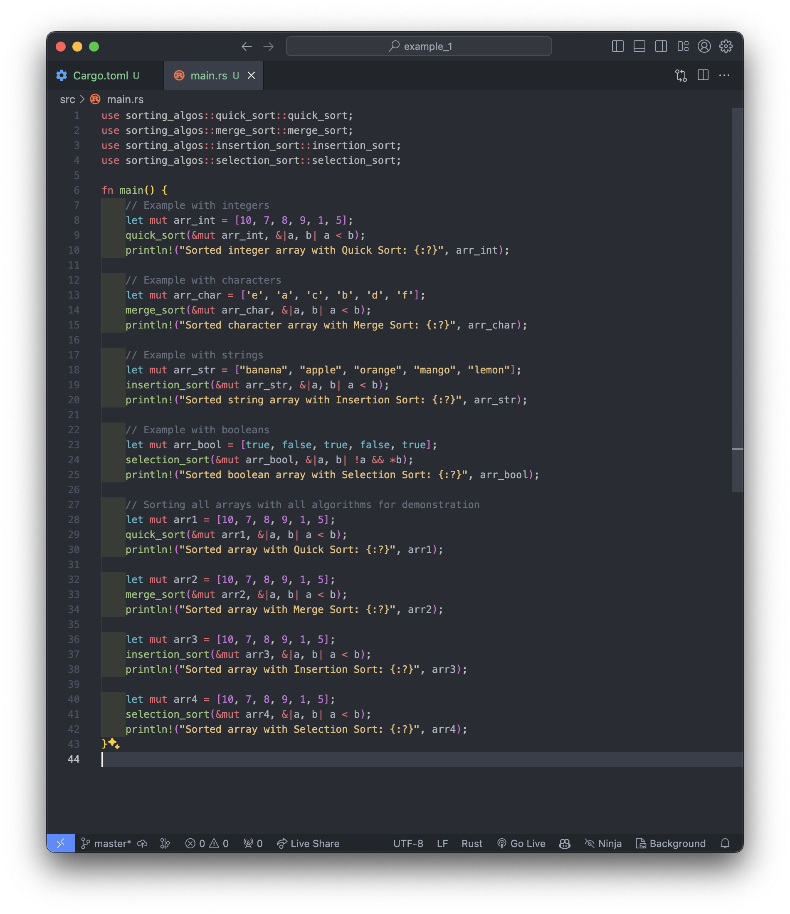

Sorting Algorithms Crate
========================

This crate provides several sorting algorithms implemented in Rust, including quick sort, merge sort, selection sort, and insertion sort. It is designed to be easy to integrate and use in your Rust projects.

Usage
-----

### Adding Dependency

First, add the following dependency to your `Cargo.toml` file:

tomlCopy code

`[dependencies] sorting_algos = { git = "https://github.com/yernazarius/my_ass_2_blockchain_2.git" }`


### Screenshots



### Importing and Using the Algorithms

To use any of the sorting algorithms, first import them into your Rust file. Below are examples of how to import and use each algorithm:

rustCopy code

`// For using quick sort use sorting_algos::quick_sort::quick_sort;  // For using merge sort use sorting_algos::merge_sort::merge_sort;  // For using insertion sort use sorting_algos::insertion_sort::insertion_sort;  // For using selection sort use sorting_algos::selection_sort::selection_sort;`

Examples
--------

Here are examples demonstrating how to use each sorting method: <br>
```
use sorting_algos::quick_sort::quick_sort;
use sorting_algos::merge_sort::merge_sort;
use sorting_algos::insertion_sort::insertion_sort;
use sorting_algos::selection_sort::selection_sort;

fn main() {
    // Example with integers
    let mut arr_int = [10, 7, 8, 9, 1, 5];
    quick_sort(&mut arr_int, &|a, b| a < b);
    println!("Sorted integer array with Quick Sort: {:?}", arr_int);

    // Example with characters
    let mut arr_char = ['e', 'a', 'c', 'b', 'd', 'f'];
    merge_sort(&mut arr_char, &|a, b| a < b);
    println!("Sorted character array with Merge Sort: {:?}", arr_char);

    // Example with strings
    let mut arr_str = ["banana", "apple", "orange", "mango", "lemon"];
    insertion_sort(&mut arr_str, &|a, b| a < b);
    println!("Sorted string array with Insertion Sort: {:?}", arr_str);

    // Example with booleans
    let mut arr_bool = [true, false, true, false, true];
    selection_sort(&mut arr_bool, &|a, b| !a && *b); 
    println!("Sorted boolean array with Selection Sort: {:?}", arr_bool);

    // Sorting all arrays with all algorithms for demonstration
    let mut arr1 = [10, 7, 8, 9, 1, 5];
    quick_sort(&mut arr1, &|a, b| a < b);
    println!("Sorted array with Quick Sort: {:?}", arr1);

    let mut arr2 = [10, 7, 8, 9, 1, 5];
    merge_sort(&mut arr2, &|a, b| a < b);
    println!("Sorted array with Merge Sort: {:?}", arr2);

    let mut arr3 = [10, 7, 8, 9, 1, 5];
    insertion_sort(&mut arr3, &|a, b| a < b);
    println!("Sorted array with Insertion Sort: {:?}", arr3);

    let mut arr4 = [10, 7, 8, 9, 1, 5];
    selection_sort(&mut arr4, &|a, b| a < b);
    println!("Sorted array with Selection Sort: {:?}", arr4);
}
```